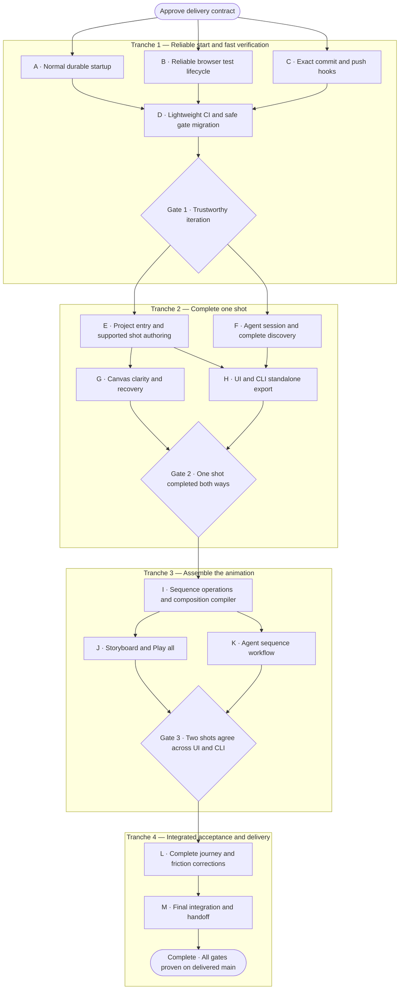

# Animation delivery plan and execution authorization

Prepared 2026-09-06 from [the app/CI review](app-experience-ci-review.md),
grounded in merged main `19fb528`. The owner approved this delivery contract,
nodes A–M, acceptance gates and execution authorization on 2026-09-06. Work is
authorized; no implementation node or gate is marked complete by this document.

## Outcome and scope

A person or agent can start the app normally, create/import supported shots,
edit them interchangeably, arrange a two-shot animation, save/reopen it, and
export deterministic HTML/CSS that works without the editor service.

Deliver one shared viewport, finite shots, hard cuts, explicit reduced-motion
output, and the current supported CSS-animation vocabulary. Start from an
included synthetic starter or import self-contained supported HTML/CSS. A
general drawing/layout editor is not required. Add only the document/sequence
capabilities needed for this flow. Preserve existing supported cue operations.
Crossfades, audio, video export, nesting, arbitrary script imports, mixed shot
viewports, MCP, package publication, hosted deployment, and Lineage integration
remain outside this contract. Existing local data must remain readable or have
a tested, recoverable migration; destructive resets are not a migration.

## Dependency graph

Arrows are prerequisites. Sibling nodes can run in parallel under the ownership
rules below. Gates require evidence, not another approval. No duration or
staffing estimate is implied by diagram width.

## Evidence rules for every node

Each node's PR states its user-facing claim, its three realistic failure modes
(listed below), the tests that could disprove the claim, and results tied to
the tested commit. A completed implementation without its required evidence
is incomplete. A test that only inspects internal state cannot by itself prove
the UI journey. Use public controls and CLI commands for journey tests, and
domain/service/compiler tests for invariant details.

Reuse the existing verification manifest and focused leaves. Add tests for
new failure boundaries, not snapshots that merely restate implementation.
Run the affected leaf while editing, rely on hooks for their tiers, and reuse
unchanged passing evidence. Repetition below is targeted stability/performance
testing at a changed boundary, not a ceremony for every worker or handoff.

For visual fidelity use the existing controlled browser/font/layout harness:
source and canonical digests; imported/unsupported/missing inventories;
export digest; stable frames and transition-adjacent frames. Existing exact
pixel comparisons retain zero changed pixels; do not loosen thresholds to get
green. Compare repeated runs within the same pinned environment, not across
different operating systems. UI layout assertions use geometry and usability
checks instead of requiring identical pixels across screen sizes.

No new skipped/quarantined test or hidden retry counts as passing acceptance.
An intentional out-of-scope capability must fail visibly. An unresolved failure
is investigated and fixed or explicitly blocks the relevant gate.

## Tranche 1: reliable start and fast verification

### A — Normal durable startup

**Depends on:** approval. **Owns:** launcher, managed local context/configuration,
connection screen, startup documentation; coordinate launcher changes with B.
**Grounding:** normal startup currently produces `SERVICE_REQUIRED` on Create.

**Accept when:** the documented command, on a fresh checkout and isolated data
directory, opens a named localhost app, permits its advertised first edit,
and retains it after app/service restart. No hand-authored environment file,
capability copying, fixture flags, or source edit is needed. A second project
and a second worktree remain isolated. Missing service, occupied port, and
unwritable data directory produce actionable errors and no false saved state.
Shutdown leaves no listener, child service, or held database lock.

**Proof:** launch the real command in a subprocess; create using browser
controls; restart and inspect persisted edit; exercise the three errors and
cross-project isolation. **Challenge:** misleading readiness, lost edits,
cross-project writes.

### B — Reliable browser test lifecycle

**Depends on:** approval. **Owns:** test-server helper, Playwright configuration,
browser failure evidence. B consumes A's launcher interface; A owns its source.
**Grounding:** main browser CI failed with an unexplained child exit; helpers
drop stderr and some choose random ports from a small range.

**Accept when:** the failing startup path has captured diagnostics and a
supported cause/fix, or a concrete unresolved blocker remains. Shared helpers
use collision-safe startup, bounded sanitized stderr, and cleanup on success,
timeout, exit, and interrupted tests. Install and select the same pinned test
browser. Preserve separate installed-Chrome QA where required.

**Proof:** 20 start/edit/stop cycles, including concurrent isolated instances;
inject occupied-port/early-exit/timeout conditions; assert no leaked process,
port, or lock. Run the previously failing reconciliation/workspace tests locally
and in CI. One intentional test failure must produce readable diagnostic
artifacts without secrets. **Challenge:** startup collisions, orphan processes,
unexplainable false failures. Do not call the historical failure fixed solely
because a rerun passed.

### C — Exact commit and push hooks

**Depends on:** approval. **Owns:** Husky hooks, verification selection, hook
tests and documentation; D owns workflow files and GitHub configuration.
**Grounding:** current hooks miss types/build and inspect working-tree content
rather than necessarily the staged or pushed content.

**Accept when:** commit checks inspect staged blobs for privacy, forbidden
artifacts, size and manifest consistency without changing unstaged work. Push
checks test the actual non-deletion tips supplied by Git: fast tests, types,
build, determinism, and conservative affected service/parity leaves. Unknown,
shared, dependency, or verification changes broaden selection. Handle new
branches, multiple refs, alternate tips, deletion-only pushes and partial staging.

**Proof:** disposable Git repos with bad staged/good unstaged content and the
reverse; push an alternate bad tip from a clean checkout; test rename/deletion,
multi-ref and shared-worktree operation. Failures block the intended action.
Five measured warm runs: median commit <=2s, push <=15s on the audit-class local
machine; report max and cold setup separately. Optimize if missed; do not remove
required coverage to meet a budget. **Challenge:** testing the wrong bytes,
unsafe skips, hooks becoming the iteration bottleneck.

### D — Lightweight CI and safe gate migration

**Depends on:** A, B, C. **Owns:** workflows, manifest integration, documented
verification policy, bounded branch-protection migration.
**Grounding:** a documentation PR took 9m35s; expensive runtime suites run on
every update; six jobs and CodeQL are currently required.

**Accept when:** every code PR runs fast/type/build/determinism and a public
normal-launch UI/CLI smoke. Draft updates avoid exhaustive visual/browser
matrices. Ready PRs run the complete public graph on every subsequent head
change; merge cannot proceed until that head passes. Pure prose changes run
policy checks; executable docs, fixtures, lockfiles and configuration cannot
take the prose shortcut. Nightly and manual broad regression remain available.
Keep CodeQL enabled in this plan; revisit only through a scope change.

**Proof:** exercise an event/path matrix for draft, ready transition, ready head
update, rebase, prose-only, executable docs, canceled and failed dependencies,
nightly and manual runs. An intentionally failed/canceled required leaf must
make the aggregate gate fail; intentional inapplicability must be explicit.
Replace required job names only after the replacement gate has successful live
evidence; snapshot current settings and restore them if migration misbehaves.
Keep PR enforcement, up-to-date requirements, conversation resolution, admin
enforcement and force-push/deletion protections. Verify an unhealthy PR cannot
merge. Automatic ready PRs must not be downgraded to draft to evade broad proof.

Measure three actual code-PR smoke runs: execution including setup <=120s;
report queue time separately. This is a proposed budget, not a measured promise.
**Challenge:** missing required contexts, false-green skipped checks, savings
that merely shift all CI cost into local hooks.

**Gate 1:** A–D accepted; first durable edit succeeds through the normal entry;
the historical startup failure is explained/addressed; exact-ref hook tests
pass; lightweight and full CI policies enforce the intended heads. Existing
broader gates stay in effect until the tested migration is complete.

## Tranche 2: complete one shot

### E — Project entry and supported shot authoring

**Depends on:** Gate 1. **Owns:** project/shot entry operations, import/starter
flow, data-backed action eligibility, editor routing and tests.
**Grounding:** modes require environment switches; choices and legacy hold
behavior contain fixture-specific identities and times.

**Accept when:** create/open a project, choose a starter or import supported
self-contained HTML/CSS, name the shot and select objects by readable labels.
Eligible Move/Fade/Reveal/Type/Hold actions appear from the loaded document;
unsupported actions explain their restriction. All previously supported cue
actions remain reachable where eligible. No mode restart is required.
Arbitrary IDs/cue names/durations in synthetic variants do not trigger fixture
assumptions. Generalize only the required hold/ripple path; accurately name any
retained restricted legacy command.

**Proof:** use the current public trajectory/reusable-cue examples and a newly
authored supported scene with different IDs, labels and duration. Assert full
animation inventory or an explicit rejection; invalid import leaves the project
unchanged. Create a hold at a chosen supported boundary; verify later order,
duration and undo. Restart and reopen. **Challenge:** silent import loss,
fixture-dependent eligibility, cross-shot state leakage.

### F — Agent session and complete discovery

**Depends on:** Gate 1. **Owns:** CLI context, discovery, examples, argument
translation and structured error output; E owns new domain operations.
**Grounding:** repeated low-level configuration; missing review command help;
ordinary units and complete workflows are not discoverable.

**Accept when:** from a project directory an agent discovers project/branch,
stable IDs, eligible operations and working command examples without reading
source or copying secrets. Every advertised command has valid help; every
supported public command is discoverable, including review commands. Ordinary
seconds/pixels translate deterministically to canonical units. Ambiguous names
require explicit selection. Claims, expected revisions and operation identity
remain enforced; convenience never silently retargets a stale edit.

**Proof:** invoke the real CLI process using only shipped help for discovery,
claim, edit, validation, release and recovery; validate help examples. Test
ambiguous name, stale revision, expired/wrong claim, unit boundaries and redacted
errors. Existing CLI/service parity stays green. **Challenge:** false discovery,
unsafe convenience, leaking credentials or private material.

### G — Canvas clarity and recovery

**Depends on:** E. **Owns:** canvas fit, overlays, timing labels, focus, draft
and saved status. Avoid concurrent changes to E's shell; integrate E first.
**Grounding:** small off-center preview, tiny labels and technical feedback.

**Accept when:** supported scenes are centered at a useful fit scale; overlays
stay legible independently of content zoom. At 1280x720, 1440x900 and 390x844,
essential controls remain reachable without page-wide horizontal overflow;
no visible label or target overlap obstructs selection. Keyboard users can
select objects/moments, add/remove/edit, undo/redo and reach reduced motion.
Use consistent ordinary units with exact values available. Every edit exposes
pending/saved/rejected status; rejection preserves draft/focus and the prior
committed preview. One completed gesture produces one history operation.

**Proof:** actual browser walk at each size, geometry/hit-target assertions,
screenshots and keyboard walkthrough; invalid value, service interruption and
agent-conflict cases. Repeat the affected gesture after each correction, then
the repository's full canonical UX loop. **Challenge:** pretty but unusable
canvas, incorrect pointer mapping, misleading save/undo/conflict feedback.

### H — UI and CLI standalone export

**Depends on:** E, F. **Owns:** export service route/CLI command, isolated UI
export component, compiler integration and artifact tests.
**Grounding:** compiler and proof digests exist; ordinary artifact delivery is
missing from the authoring journey.

**Accept when:** UI and CLI export the selected shot's committed revision as
usable HTML/CSS plus a receipt. Pending/stale state cannot produce a mislabeled
export. Unsupported inputs block export with actionable diagnostics. Explicit
reduced-motion output can be inspected before export. Names/paths do not cause
silent overwrite or cross-project export. Presentation exports may contain the
user's authored material locally; sanitized receipts/logs must not disclose it.

**Proof:** export through both surfaces from the same revision and compare
byte-identical files/digests across three runs and a restart. Stop the service,
open the result independently, exercise playback and reduced motion, and
compare stable and discrete-boundary frames using the existing proof harness.
Confirm no editor service or external network dependency for the self-contained
fixtures. **Challenge:** proof mistaken for an artifact, wrong-revision output,
visual or reduced-motion divergence.

**Gate 2:** E–H accepted; one new supported shot completes through UI only and
CLI only from equivalent bases with equal canonical/export content. A mixed
workflow survives reload and a rejected stale edit. No fixture flag, source
edit, database edit or private credential copying is needed. G's full browser
loop and installed-Chrome QA pass on the integrated implementation. Evidence
must distinguish canonical content equality from actor-specific audit metadata.

## Tranche 3: assemble the animation

### I — Sequence operations and composition compiler

**Depends on:** Gate 2. **Owns:** sequence schema, service persistence/migration,
typed operations, compiler and deterministic proof; freeze this contract before
J/K implement clients. This is the explicitly proposed new capability boundary.

**Accept when:** a sequence references stable shot identities and exact content
revisions, with an ordered finite duration model and one viewport. Support
add/duplicate/remove/reorder/rename, duration or hold edits, undo/redo and
explicit updates to referenced shot revisions. Shot-local time is unchanged by
reordering. Duplicate edits cannot silently mutate the original. Stale revisions
and wrong claims fail atomically across every affected record. The service
remains sole writer. Existing projects open after a tested recoverable migration.

Define half-open shot intervals [start,end); at a cut the next shot owns the
frame, and after the final endpoint the declared final state remains. Compile
one deterministic browser-native artifact with isolated selectors/keyframe names,
correct delays/fill and intentional reduced motion. Reject unsupported infinite
durations, incompatible viewports and source constructs before committing.

**Proof:** two synthetic 2s/3s shots deliberately reuse selectors, keyframe names
and element labels; reorder and hold them; assert cut times and unchanged local
motion. Compare frames at every cut −1ms, at cut, +1ms, plus beginning, stable
interiors and final endpoint. Use an independently specified active-shot oracle,
not the composition compiler to generate both expected and actual results.
Three runs plus restart must retain identical output. Exercise stale writes,
claim isolation, failed migration and failed transaction recovery.
**Challenge:** cross-shot CSS bleed, wrong time/revision mapping, partial writes.

### J — Storyboard and Play all

**Depends on:** I. **Owns:** storyboard UI, sequence selection and playback,
integration with the existing shot canvas. Shares no writer or compiler ownership.

**Accept when:** users can add/import or duplicate a second shot, rename,
reorder by pointer and keyboard, change supported duration/hold, delete and undo.
Thumbnails/names/order/duration always represent the committed sequence.
Switching shots preserves the correct selection and handles pending drafts
explicitly. Shot preview and Play all are unmistakable; global scrubbing crosses
cuts correctly and uses compiled sequence output.

**Proof:** browser actions for each operation, undo/redo, reload, invalid timing,
pending-draft switch and stale agent update. Assert displayed order and cut
frames against I's independent oracle; repeat at G's three viewport sizes.
**Challenge:** editing the wrong shot, misleading total time, separate preview
behavior from export.

### K — Agent sequence workflow

**Depends on:** I. **Owns:** CLI sequence discovery/commands and parity tests.
Can run in parallel with J against I's accepted contract.

**Accept when:** the same storyboard operations are discoverable and executable
through ordinary CLI context, with stable-ID resolution and no guessed selectors.
Claims cover the exact sequence/shot writes and expected revisions. Agent changes
appear in the open editor; human edits are visible to CLI discovery. A sequence
export identifies the exact sequence and referenced revisions.

**Proof:** real CLI and browser edit equivalent bases and compare canonical
content/export digests; then alternate edits in one project. Race two clients
from one revision: one accepted mutation, one explicit rejection, no partial
change. Retry a lost response with the same operation identity without duplicate
application. **Challenge:** UI/agent drift, hidden target ambiguity, race/retry
corruption.

**Gate 3:** I–K accepted and integrated; create two shots, edit one in UI and
one in CLI, reorder, insert a supported hold, undo/redo, restart, Play all,
export and reopen independently. All cut frames agree with the specified
oracle, exports are deterministic, and the concurrent rejection path is proven.

## Tranche 4: integrated acceptance and delivery

### L — Complete journey and friction corrections

**Depends on:** Gate 3. **Owns:** public end-to-end acceptance and only the
smallest observed UX corrections, coordinated with the module owners.

**Accept when:** complete three paths: UI-only, CLI-only, and mixed handoff.
Each starts with the ordinary launcher in isolated fresh data, uses public
synthetic input, creates/edits two shots, reorders, undoes/redoes, persists,
previews the whole animation, exports and opens it with the service stopped.
Repeat the mixed path with keyboard-only UI editing. Invalid input, lost service,
and stale agent mutation recover without corrupting saved work.

Record user-visible action counts and timings. Proposed acceptance budgets
after dependency installation: first visible authored motion <=2 minutes;
complete the prescribed two-shot task <=10 minutes, excluding CI/network queue
time. No source consultation, hidden IDs, developer console or manual database
edits. An agent conducting the walk may read public product help. These budgets
are hypotheses approved with this plan, not results of the prior audit or proof
of usability for all humans. Supply an owner replay recipe; owner participation
is optional and not a hidden completion dependency.

**Proof:** three isolated mixed-workflow runs for stability, one full UI-only
and one CLI-only path, keyboard/viewport checks, targeted error/recovery probes,
compiled-cut comparisons and sanitized trace/screenshots. Measure once on the
integrated version; repeat only after relevant changes. **Challenge:** test-only
setup hiding friction, polished paths failing under recovery, completion that
still requires authoring CSS manually.

### M — Final integration and handoff

**Depends on:** L. **Owns:** PR integration, CI monitoring, final evidence index,
current product/agent/verification documentation and scope-status update.

**Accept when:** each coherent feature has a reviewed PR and all required
checks pass on its actual final head with an up-to-date base. Resolve in-scope
review findings and CI failures, rerun affected checks, and merge in dependency
order under the authorization below. Never merge merely because a check is
pending, a previous head passed, or a workflow was disabled. Broad public
verification, installed-Chrome QA, private-content checks and the completed
journey have evidence attributable to the delivered integrated tree.

After the final merge, run a normal-launch mixed-workflow smoke on main and
dispatch one full public regression on the exact resulting main commit; monitor
to completion. Reuse prior focused/Chrome receipts only when their code and
runtime inputs are identical; otherwise rerun the affected boundary. This final
integration check is explicitly required, not a demand for a full main run after
every intermediate merge. Keep nightly/manual broad verification thereafter.

**Proof:** final commit and PR links; CI conclusions; local runtime/browser
identity; concise scenario-to-test mapping; sanitized sample artifact and
digests; measured hook/smoke/journey timings; complete diff privacy/scope review.
README must describe the actual startup and delivered capabilities; CLI examples
must execute; workflow documentation must match live required checks.
**Challenge:** green evidence for an old tree, broken integration after merges,
private content or misleading documentation in the handoff.

## Parallelization and PR rules

- Initial lanes: A startup, B browser harness, C hooks. Agree the launcher
  contract first; B sends launcher requirements to A instead of editing it.
- After Gate 1: E product entry and F agent context can proceed together.
  After E: G canvas and H export can proceed together if F is ready, using
  separate UI components and one designated shell integrator.
- After I: J storyboard and K agent sequence run independently against the same
  accepted operation schema. Neither adds a second writer or private compiler.
- D, tranche integration, and M's GitHub settings/merge actions have one owner.
  Shared manifest/schema/lockfile changes have one integrator. Never run agents
  concurrently against the same database, claimed document or QA port.
- One coherent feature per branch/worktree/PR. Nodes can be split into smaller
  behaviorally complete PRs; no unrelated features in one PR. Read-only research
  and test design may begin early; dependent implementation waits for the
  prerequisite contract. Use stacked PRs only with explicit bases and reverify
  changed integration after rebasing. Preserve others' changes; never force-push
  shared work or reset unrelated files.
- Delegate bounded independent packages when useful, with file ownership and
  the same acceptance contract. Do not duplicate full-suite execution across
  agents. Publish only sanitized product plans/evidence, not execution transcripts.

## Overall completion gate

Completion requires the conjunction of Gates 1–3 and L–M, not a percentage of
tasks or an exhausted time budget. Specifically:

1. Normal installation/startup, durable restart and project isolation work.
2. Supported shot creation/import/edit/export work from both UI and CLI.
3. Two shots compose with tested cuts, no CSS bleed, correct local/global time,
   explicit revision references and intentional reduced motion.
4. UI-only, CLI-only, mixed and keyboard journeys pass; rejected operations and
   service interruptions preserve saved content and explain recovery.
5. Same committed content yields byte-identical exports; standalone output
   matches compiled preview and requires no editor service.
6. Local hooks inspect the correct content; smoke/full CI cannot be evaded by
   missing/skipped/canceled checks; agreed performance budgets are measured.
7. All implementation PRs are merged, exact final main public CI is green,
   final local smoke succeeds, and no unresolved in-scope blocker remains.
8. Final docs, artifact, evidence links and remaining out-of-scope limitations
   are accurate. Synthetic acceptance does not claim private-corpus fitness or
   independent human user-study validation.

## Approval statement

I approve this Animation Delivery Plan, nodes A–M and all acceptance gates.
Implement it end-to-end in the standalone lineage-motion repository, including
the bounded shot/sequence model, persistence changes and migrations, compiler,
UI and CLI work necessary for the stated outcome. Create isolated worktrees
and branches; delegate independent subtasks; install repository dependencies;
run local services and public synthetic tests; fix in-scope defects; commit,
push, create and update PRs; monitor and rerun CI where justified; address
review findings; and merge passing PRs in dependency order. Continue through
the final integrated-main checks and handoff without requesting approval at
each node or tranche.

I authorize the described Husky/verification changes and the bounded migration
of this repository's required CI contexts to the tested replacement gates.
Reduce exhaustive checks on draft updates, retain full checks for ready PRs,
retain nightly/manual regression and CodeQL, and preserve the other branch
protections. Snapshot and restore verification settings if that migration fails.

Use only public synthetic acceptance data unless I separately identify and
authorize private input. Keep credentials, databases and private material out
of commits, logs and PRs. This does not authorize Lineage repository/service
changes, external publication/deployment, paid services, destructive data loss,
force-pushing shared branches, or weakening access controls. Pause only for a
genuine missing decision, unavailable credential/access, an action outside
this scope, or a non-recoverable blocker. Report the concrete issue and proceed
with independent authorized work where possible. Do not silently waive an
acceptance criterion to claim completion.
