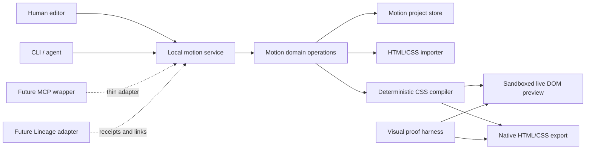

# Architecture Boundary

## Shape



## Intended package boundaries

```text
apps/
  editor/                 React/Vite local web app
  service/                local HTTP service and sole writer
packages/
  domain/                 schemas, operations, validation, revisions
  css-import/             HTML/CSS inventory and canonical import
  css-compiler/           deterministic native CSS export
  preview-runtime/        development-only iframe playback/scrubbing
  cli/                    thin service client
  visual-proof/           browser capture and frame-diff harness
fixtures/
  public-synthetic/       non-private regression scenes
```

Create these directories only as their phase begins. The topology is a boundary
map, not authorization to prebuild every package.

## Canonical document direction

The schema is intentionally unfrozen. The first slice should prove at least:

```ts
interface MotionDocumentV1 {
  schema_version: 'motion.document.v1';
  id: string;
  revision: number;
  duration_ms: number;
  elements: Array<{
    id: string;
    selector_hint: string;
    pseudo?: 'before' | 'after';
    source_fingerprint: string;
    editable_text?: string;
  }>;
  tracks: Array<{
    id: string;
    element_id: string;
    property: string;
    animation_slot: number;
    delay_ms: number;
    iteration_count: number | 'infinite';
    interpolation: 'continuous' | 'discrete' | 'steps';
    keyframes: Array<{
      id: string;
      time_ms: number;
      value: string;
      easing?: string;
      hold?: boolean;
    }>;
  }>;
  cues: Array<{
    id: string;
    time_ms: number;
    label: string;
    kind: string;
  }>;
  reduced_motion: {
    strategy: 'snapshot';
    at_ms: number;
  };
  source_binding: {
    kind: 'html';
    imported_sha256: string;
    generated_region_sha256?: string;
  };
}
```

Key decisions:

- stable data-backed IDs are identity; selectors are rebinding hints;
- canonical time is integer milliseconds, with CSS percentages derived by the
  compiler;
- import may expand shared rules into element/property tracks;
- export may deduplicate identical tracks without changing semantics;
- cues carry narrative intent such as type, click, select, drag, reveal, and
  hold;
- values remain lossless CSS strings until typed parsing is proven;
- responsive and reduced-motion behavior belong in the document model even
  when their authoring UI is deferred.

## Import and export contract

Import is explicit and one-directional:

```text
HTML/CSS source -> inventory -> diagnostics -> canonical document
```

Reimport is a separate operation that detects source drift and proposes stable
ID mappings. It is not an indefinite lossless round-trip promise.

The compiler validates invariants, derives percentages, preserves timing
semantics, emits deterministic names/order/formatting, and returns a receipt
with document revision/digest, compiler version, source digest, output digest,
warnings, and unsupported features.

Preview renders this compiler output in a sandboxed iframe, pauses the browser's
animations, and scrubs them with browser animation time. It must not implement a
second animation engine.
