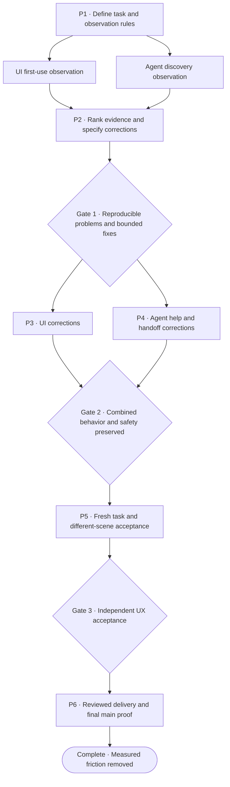

# First-use polish plan

Owner-approved tranche P1–P6 (2026-09-07), grounded in delivered main `e1f229a5d1352a3fd82fcec7fd69c32b7c82bc84`.
The owner authorized execution of this plan on 2026-09-07. This approval does
not claim that any audit, implementation or acceptance gate has passed. The completed A–M delivery contract remains historical evidence.

## Outcome

A first-time operator can discover how to create two supported shots, assemble
them, hand work between the UI and an agent, and obtain a playable animation
without implementation knowledge or coaching from the developer.

Correctness is already supported by the [delivery evidence](animation-delivery-evidence.md).
The gap is discoverability: the [existing walkthrough](animation-walkthrough.md)
provides exact controls, values and commands. Its fast automated completion times
do not demonstrate independent human usability.

Keep this tranche small: observe first, select at most three material friction
problems, and correct them using existing product capabilities. No speculative
redesign, new animation features or CI migration.

### Approved recovery exception

During independent acceptance, selecting an available exact opacity target
blocked creation of another shot. The offered action-draft discard did not
clear that selection, so the operator committed an unwanted track to proceed.
On 2026-09-07 the owner explicitly approved one fourth correction for this
reproduced recovery failure. The original three-fix limit otherwise remains;
this exception does not authorize additional features or waive any gate.

The correction must expose a discoverable, keyboard-accessible way to discard
the blocking exact-track draft while preserving the entered new-shot name.
Cancellation must leave the current shot's tracks, revision and compiled
preview unchanged, and subsequent shot creation must succeed. It must neither
discard other unapplied timing/action drafts nor bypass a pending save. Focus
and feedback must make the remaining state and next action clear. An independent
operator must challenge this recovery through the public UI, including the
responsive and zoom checks in UX3–UX4. Focused regression tests must falsify
unintended mutation, lost input, and bypass of other draft/pending-write guards.
The correction receives its own branch and PR, independent review, local hooks,
full ready-PR CI and affected integrated acceptance before delivery.

## Dependencies and parallel work

UI and agent observations can run independently with separate projects and data.
P3/P4 may run concurrently only after shared terminology, ownership and any public
help contract are agreed. Shared UI shell, operation schema and manifest changes
have one integrator; serialize overlapping changes. One coherent correction per
feature branch/worktree and PR. Do not create separate PRs for ceremonial gates.

## Mandatory acceptance and QA rules

Every node below has a binary result: **passed**, **failed/blocked**, or
**inapplicable with evidence**. Inapplicability is allowed only for an unneeded
P3/P4 correction lane, never for observation, independent acceptance, final
verification or an unresolved task blocker. Each criterion is identified below;
its result links to the exact commit/input and the smallest sufficient evidence.
A screenshot alone cannot prove interaction or persistence, and a passing script
alone cannot prove discoverability or visual quality. Reuse evidence across
criteria when it proves the same unchanged behavior; do not create parallel
execution boards, role rituals or duplicate test runs.

**Manual QA means interactive exploratory use of the running app:** inspect the
visible screen, decide the next action from that screen/help, use real pointer or
keyboard input, observe the result and deliberately explore confusion/recovery.
A prewritten Playwright journey is automated regression, not manual QA. An agent
may operate the visible browser and terminal for this interactive QA; record that
explicitly. Do not describe it as testing with a human novice. No hidden test flags,
DOM mutation to perform edits, private credentials or implementation-derived
selectors are supplied to the discovery operator. DOM/accessibility inspection
for operating visible controls and read-only instrumentation for verification are
allowed and kept distinct from authoring. Actual human participation is optional.

**Evidence minimum:** tested commit, operator type, browser/runtime, viewport,
public input, action and observed result; screenshots at meaningful before/after
states; short notes for hesitation, backtracking and recovery; focused test result
and artifact/digest where relevant. Keep raw sessions local and ignored. A reviewer
who did not author the correction must inspect its acceptance evidence and
interactively challenge its primary usability claim, without rerunning the full
suite. The implementer can do routine exploratory QA, but cannot be the only
judge of their own polish or count as an unprimed operator.

### UX quality bar — required for every changed surface

These are acceptance conditions, not optional aesthetic suggestions:

| ID | Required behavior | Direct manual/inspection evidence |
| --- | --- | --- |
| UX1 · Orientation | At initial entry, first edit, shot switch, agent handoff and export, the operator can identify the selected shot/animation, saved versus unapplied state, playback scope and next task action without developer hints. No wrong-target committed edit. | Record the operator's prediction before the relevant action and verify the result afterward; mark irrelevant questions explicitly. |
| UX2 · Hierarchy and restraint | The current task's primary action is visually prominent; shot and full-animation controls are distinguishable. No competing primary actions with unclear scope, redundant instructions, or implementation details dominating the task. | Review full screens, not cropped components; an independent operator finds and names the intended action. Any confusion is a finding, not a subjective pass. |
| UX3 · Visual finish | Consistent typography, spacing, alignment and control treatment across changed states. No clipped labels, accidental crowding, obstructing overlays, illegible preview labels or empty/error/loading-state layout breaks. | Inspect 1280×720, 1440×900 and 390×844, with short and long user-created names and an empty/first-use state where supported. Keep comparable screenshots. |
| UX4 · Access and reachability | No page-wide horizontal overflow or hidden essential controls at those sizes or desktop 200% zoom. All changed actions work using keyboard alone; focus is visible and follows a logical order, returns from dialogs, and is not trapped. Information is not conveyed by color alone. | Interactive keyboard/zoom replay plus geometry and accessible-name assertions. Project targets: ordinary text contrast ≥4.5:1; essential control/focus boundaries ≥3:1 against adjacent colors; primary mobile action height ≥44 CSS pixels and changed compact targets ≥24×24 CSS pixels. Inspect measured rendered colors and target bounds; this is not a blanket accessibility certification. |
| UX5 · Feedback and recovery | Loading/pending, saved, rejected and unconfirmed states remain distinguishable. Errors identify the affected action and a safe next step, preserve correctable input/focus, and do not falsely claim success. | Exercise invalid input, service interruption and stale agent state. Verify committed preview/revision and recovery through public controls. |
| UX6 · Preview and completion | A useful visible motion result follows supported defaults; shot versus full playback, source-pin updates and the correct download are discoverable. Motion, cut frames and reduced motion agree with the compiled standalone output. | Play, pause, scrub, inspect reduced motion, download, stop the service and open the artifact. Confirm both shots and intended order/hold, rather than just existence of a ZIP. |

Apply this bar to changed surfaces and the critical complete-task flow, not every
historical feature in the repository. Any new blocker or material UX regression in
that flow prevents acceptance even if it was not one of the original three fixes.
Do not lower the bar after seeing results. An out-of-scope problem is a disclosed
scope decision, not an automatic waiver.

### Node acceptance checklist

All criteria in the relevant row and its detailed section must pass.

| Node | Rigorous exit criteria | Required manual QA and supporting tests |
| --- | --- | --- |
| P1 · Protocol | P1.1: outcome-only brief, fresh-data procedure, two public input families, allowed help and metric definitions fixed before observation. P1.2: operator blindness/source access recorded. P1.3: exact running checkout and ordinary launcher confirmed; observation ownership covers all three baseline paths. | Inspect the actual first-use screen and launcher identity. Do not rehearse the detailed solution with the discovery operator. Freeze the protocol before U/A observation begins. |
| U · UI observation | U.1: one fresh UI-only attempt and the UI portion of the mixed attempt observed interactively. U.2: all applicable UX1–UX6 checkpoints assessed. U.3: every obstacle and intervention recorded; an unfinished task is not reclassified as success after coaching. | Visible-browser pointer use plus a keyboard/recovery probe of the affected task. Retain checkpoint screenshots and counts; passing baseline behavior is not required to discover a valid problem. |
| A · Agent observation | A.1: one fresh CLI-authoring attempt and the agent portion of the mixed attempt use only public help/discovery. A.2: actual commands, errors, revisions and handoff outcome recorded with secrets excluded. A.3: guessed targets, help dead ends and unsafe recovery temptations are recorded. | Interactively read CLI help and choose commands; inspect the corresponding visible UI and exported artifact. Do not substitute a supplied end-to-end command script. |
| P2 · Correction contract | P2.1: each selected finding reproduced and ranked by task impact. P2.2: exact observable before/after criterion, affected UX IDs, smallest correction, owner and falsifying test fixed before edits. P2.3: every observed blocker has a disposition; no material blocker is hidden by the three-fix cap. | Replay each selected failure on baseline. Inspect the proposed control/copy/state treatment in context; each criterion must specify what an independent operator must successfully do or understand. |
| P3 · UI correction | P3.1: all selected UI criteria pass. P3.2: UX1–UX6 pass wherever applicable to the changed surface. P3.3: negative/recovery, focus and history checks preserve the intended revision/preview. | Before/after reproduction, responsive and 200% zoom inspection, keyboard replay, applicable empty/loading/error states; changed-boundary tests. Independent interactive challenge of the primary improvement. |
| P4 · Agent correction | P4.1: all selected help/handoff criteria pass through real CLI processes. P4.2: every changed example executes from discovered values. P4.3: no regression in explicit target, revision, claim, pin-update or exact-retry behavior. P4.4: terminology agrees with the visible UI. | Fresh help-led discovery and two-way UI/agent handoff; deliberate stale/claim/recovery probe at the changed boundary; focused CLI/help/parity tests. Independent interactive challenge of the primary improvement. |
| P5 · Independent acceptance | P5.1: fresh UI-only, CLI-only and mixed tasks complete without developer intervention; permitted public help use remains recorded. P5.2: different-scene mixed keyboard task passes. P5.3: selected friction criteria improve as specified, and UX1–UX6 have no material failures. P5.4: artifact, persistence, recovery and native-frame checks pass. | Outcome-only interactive attempts by unprimed operators, visual/keyboard review of integrated UI, final canonical browser loop and installed-Chrome QA. Automated tests complement rather than replace these observations. |
| P6 · Delivery | P6.1: independent review findings resolved; each PR's final head is up to date and passes its required checks. P6.2: final main passes local mixed smoke and full manual-dispatch public CI. P6.3: scope/privacy and preserved protections verified. P6.4: final evidence, sample output, replay and limitations published accurately. | Confirm the final running app belongs to delivered main and replay mixed creation-to-offline-output there. Reuse unchanged accepted visual evidence; rerun affected manual QA if code or runtime inputs changed. |

P1 closes when the observation protocol is fixed. U and A then execute the
independent observations and coordinate one fresh mixed baseline. P2 cannot pass
until U, A and that mixed baseline are complete. A manual acceptance failure requires a correction and
recheck of that failure path, even when all automated tests pass.

## P1 — Define the baseline; U/A — Observe it

**Task brief:** “Create two named shots with visible motion, arrange them in the
opposite order, hold the first shot briefly, undo and redo a change, preview the
whole animation, reopen saved work, and export something that plays after the
app stops. In the mixed path, let an agent change one shot and deliberately bring
that new version into the animation.” Supply the intended result, not click paths.

After P1 fixes the protocol, U/A observe one UI-only, one agent-only and one
mixed attempt from fresh projects.
The UI operator may use visible help and public documentation; the agent starts
with the ordinary launch command and public CLI help. Record documentation visits.
Neither gets the existing step-by-step test, implementation source, selectors,
copied credentials, hidden IDs or developer-console authoring. A source-reading
implementer is not a valid unprimed discovery operator. Use a fresh agent context
with only the brief/public help when a human observer is unavailable; label it an
agent observation. Real novice-user participation is optional, and any such
session needs its own agreed participation and evidence/privacy boundaries.

Use shipped starters first. If their suitability for the task is unclear, record
that as evidence; do not silently substitute a preconfigured imported scene.
Also supply a public synthetic supported scene as a ready-made input, without
requiring the operator to write CSS. No customer or private project content.

**Observation acceptance (U/A):** baseline identifies exact commit, browser/runtime, input, task,
operator type and permitted help. Each obstacle records action/intent, expected
result, observed result, impact and screenshot or command receipt. Record time
to first authored motion and offline artifact, control actions, CLI commands,
help visits, backtracking, wrong-target attempts and developer interventions.
Separate task time from installation, queue and observer interruptions. A blocked
attempt remains a blocked result; assisted continuation is labeled separately.

**Proof:** ordinary launcher on an isolated named `.localhost` address; public
UI/CLI interactions; observed result and saved/exported artifact, where reached.
Do not call automated observations a human usability study.

## P2 — Select and specify the smallest corrections

Candidate investigation areas, not established defects:

| Area | Grounding in the current app | Question to answer |
| --- | --- | --- |
| First motion | `project-entry.ts` offers two starters and HTML/CSS import; the walkthrough instead supplies two files to paste | Can an operator choose a suitable start and make motion without outside explanation? |
| Shot versus full animation | `sequence-storyboard.ts`, `sequence-view.ts` and the shot editor expose separate selection and playback controls | Can the operator identify what is selected, what Play affects, and which source version an occurrence uses? |
| Agent handoff | `agent-cli.md` and `agent-sequence-guide.md` require context, discovery, explicit claims and pinned revisions | Can help make the next safe action discoverable without weakening those rules? |
| Completion | Shot and full-animation downloads are distinct; offline output requires ZIP extraction | Can the operator find the correct artifact and verify completion? |

Rank observed blockers, wrong-target/saved-state confusion and recovery failures
above extra steps or appearance. Select at most three reproducible material
problems. Each selected finding must state its smallest change, owner, affected
files, observable before/after criterion and test that could falsify the fix.
For example, “the operator locates full-animation download without intervention
and receives both shots” is testable; “make export intuitive” is not.

**Acceptance / Gate 1:** every selected problem is reproduced on current main,
has direct evidence and a bounded correction within this scope. Resolve shared
terms before parallel editing. If there is no finding for a lane, record it as
inapplicable with evidence rather than inventing work. If more than three blocking
problems must be fixed to complete the task, expose that scope decision; do not
quietly exclude blockers or claim the task is usable.

## P3 — Correct the observed UI friction

Own only selected UI findings: control order, labels, useful existing defaults,
selection/playback hierarchy, contextual guidance, focus and actionable feedback.
Reuse existing domain operations and compiler output. A guided wizard, new starter
system or general layout editor is not preapproved as the solution.

**Acceptance:** each P2 criterion passes through actual browser controls; target,
saved state and next action are observable. Relevant controls remain reachable at
1280×720, 1440×900 and 390×844, with no obstructing overlap or page-wide horizontal
overflow. Keyboard focus remains visible and predictable. Invalid input preserves
the draft and prior saved preview; undo/redo restores the intended state. Guidance
must not obscure claim, stale-revision or unsupported-input failures.

**Proof:** repeat each original failure action before/after, retain concise visual
evidence, and run the affected manifest leaf. Follow [browser QA](browser-qa-loop.md)
for changed editor interactions; expand tests only at newly affected boundaries.

## P4 — Correct observed agent discovery and handoff friction

Own selected public help/examples, context explanations and recovery guidance.
Improve how existing commands are found and explained. CLI parsing or output
adjustments are allowed only for a reproduced discovery problem and must preserve
compatible public behavior. No new autonomous claim management or general API.

**Acceptance:** a fresh help-driven operator discovers project, shot/sequence,
revision and eligible operations without guessing IDs or reading source. Every
changed example executes with public discovered values. Agent changes appear in
the UI; human changes appear in CLI discovery. Changed source content stays out of
a pinned occurrence until explicitly updated. Stale writes reject atomically;
recovery never silently advances expectations, reacquires claims or retargets work.
Credentials remain in private local handles and are absent from public examples.

**Proof:** real CLI processes and the open editor demonstrate each corrected
handoff; focused CLI/help, parity or recovery tests cover the changed contract.

**Gate 2:** all selected P3/P4 criteria pass on their combined implementation.
One mixed path confirms shared terminology and target identity. Existing safe
claim/revision, pending-save, pin-update and deterministic export behavior remain
intact. Reuse passing unchanged invariant tests; no second writer or preview path.

## P5 — Validate discovery and generalization

Repeat the outcome-only UI, agent and mixed task with fresh data and an operator
context that has not seen the fixes or test implementation. Report learning effects
if the same human repeats it. Then run a mixed keyboard task using a different
public supported scene with changed names, IDs and durations, so success cannot
depend on the baseline fixtures. Keep finite compatible viewports and existing
supported operations. The variant may be authored as a test input by the team;
the task operator is not required to author CSS.

**Acceptance:** each path reaches an independently playable exported animation
without developer intervention, guessed IDs, secret copying or source consultation.
No unresolved selected finding, wrong-target mutation, false saved state or silent
unsupported-content loss remains. Verify reload/restart, invalid timing, a stale
agent update and interrupted-save recovery. Keyboard operation and reduced motion
must remain intentional. Check native frames around the actual cut, not hardcoded
old fixture times; repeated export from the same revision remains byte-identical.

Compare the P1 metrics honestly. Each selected friction measure meets its P2
criterion; explain increases elsewhere and investigate any newly blocking or
misleading behavior. Report human and automated times separately. Keep the existing
automated journey budgets (first motion ≤120s, complete task ≤600s); those are
regression limits, not evidence that a human finds the experience easy. Do not
invent a percentage speedup target before observing the baseline.

**Proof:** public controls/help-only discovery receipt; distinct-scene mixed run;
focused regression assertions for fixed problems; final canonical browser loop
and installed-Chrome QA once on the integrated UI implementation. Retain sanitized
sample artifact, source/canonical/export digests and before/after observations.

## Milestone acceptance gates

| Milestone | Pass only when | Evidence and rejection conditions |
| --- | --- | --- |
| Gate 1 · Ready to implement | P1, U, A and P2 satisfy every applicable criterion; selected fixes have frozen acceptance contracts and non-overlapping ownership. | Review the baseline screens/commands and replay selected failures. Reject if the problem is assumed from taste, the baseline was coached without disclosure, criteria are vague, or an unresolved blocker was omitted. |
| Gate 2 · Ready for independent acceptance | Selected P3/P4 corrections and their focused checks pass on the integrated implementation; the mixed flow preserves target/revision/claim/pin behavior. | Interactive mixed handoff and UX checklist, including a rejected action and recovery. Reject misleading saved state, competing playback scope, keyboard failure or a visual regression even with green tests. |
| Gate 3 · Ready for delivery | P5's independent discovery paths, different-scene task, full applicable UX bar and required canonical/Chrome proof pass. | Independent reviewer compares before/after evidence and challenges the primary usability claims. No developer intervention in successful paths, no unresolved selected finding or material task regression, no fixture-only workaround. |
| Final · Complete | Gates 1–3 and every P6 criterion pass, all implementation PRs are merged, exact final main has successful local and CI evidence, and no in-scope blocker remains. | Publish actual main SHA, CI links, manual QA outcomes/operator type, sample artifact/digests and limitations. Pending CI, older-head results or undisclosed manual failures cannot satisfy completion. |

These gates are evidence reviews, not repeated owner approval requests. The one
execution approval below covers bounded correction/retest cycles. If a previously
passing criterion is invalidated by a later change, reopen only that criterion
and its dependent evidence; do not rerun unrelated suites or waive the failure.

## P6 — Deliver and stop

Use [the existing execution workflow](agent-workflow.md). During editing, run only
focused changed-boundary checks. Hooks own staged/exact-push verification. Draft
code PRs use smoke CI; ready code PRs use the complete public graph on every head;
prose-only changes retain the existing conservative policy. Review changes,
address in-scope findings, and merge passing, up-to-date PRs in dependency order.
Do not repeat full local PR suites alongside already-owned hook/CI work.

**Acceptance:** all selected corrections and P5 outcomes pass, docs describe actual
behavior, complete diffs are inspected for scope/private content, and no selected
issue is hidden by a skip or retry. After the final merge, run one normal-launch
mixed smoke and one full public manual regression on the exact delivered main;
monitor to conclusion. Reuse Chrome evidence only for identical code/runtime inputs.
Publish final main/PR/CI links, concise before/after findings, artifact and limits.

Leave hooks, CI selection, branch protections, nightly/manual regression and
CodeQL unchanged. Collect timings from ordinary pushes/CI runs as available; do
not generate five extra pushes or three extra PRs for this tranche. A material
iteration slowdown becomes an explicit follow-up decision, not an unrelated fix.

## Overall completion and authorization boundary

Complete only when Gates 1–3 and all P6 criteria pass. The three adversarial
challenges are: a trained script mistaken for discoverability; easier-looking
controls that corrupt target/revision/recovery behavior; and improvements that
work only for one fixture or an older commit. The evidence above must address
all three. Stop when the selected material friction is removed; do not keep
polishing for novelty. Human ease-of-use claims require actual human observations.

The owner approved this plan and its following execution statement on 2026-09-07:

> I approve First-use Polish P1–P6, including the evidence-driven selection of up
> to three material corrections within its scope, all node/milestone criteria,
> the UX quality bar and interactive manual QA requirements. Proceed in isolated worktrees,
> delegate independent work, run local services and public tests, commit/push,
> create and update PRs, monitor and investigate CI failures, address review
> findings, and merge passing
> PRs in dependency order. Complete the specified final-main checks. Continue
> through evidence gates without repeated permission requests. Preserve existing
> CI, hooks, protections and product invariants. Do not waive acceptance criteria.
> Ask only for a genuine blocker or scope decision outside this plan. Human
> participation is optional and is not a hidden delivery dependency.

Private corpus use, external messaging/recruitment, telemetry collection, paid
services, hosted deployment, package publication, MCP/Lineage integration,
crossfades/audio/video/nesting, force-pushing shared work and destructive data
changes remain excluded. Record observations locally using public synthetic data;
commit concise product plans/evidence, never raw session or agent transcripts.
